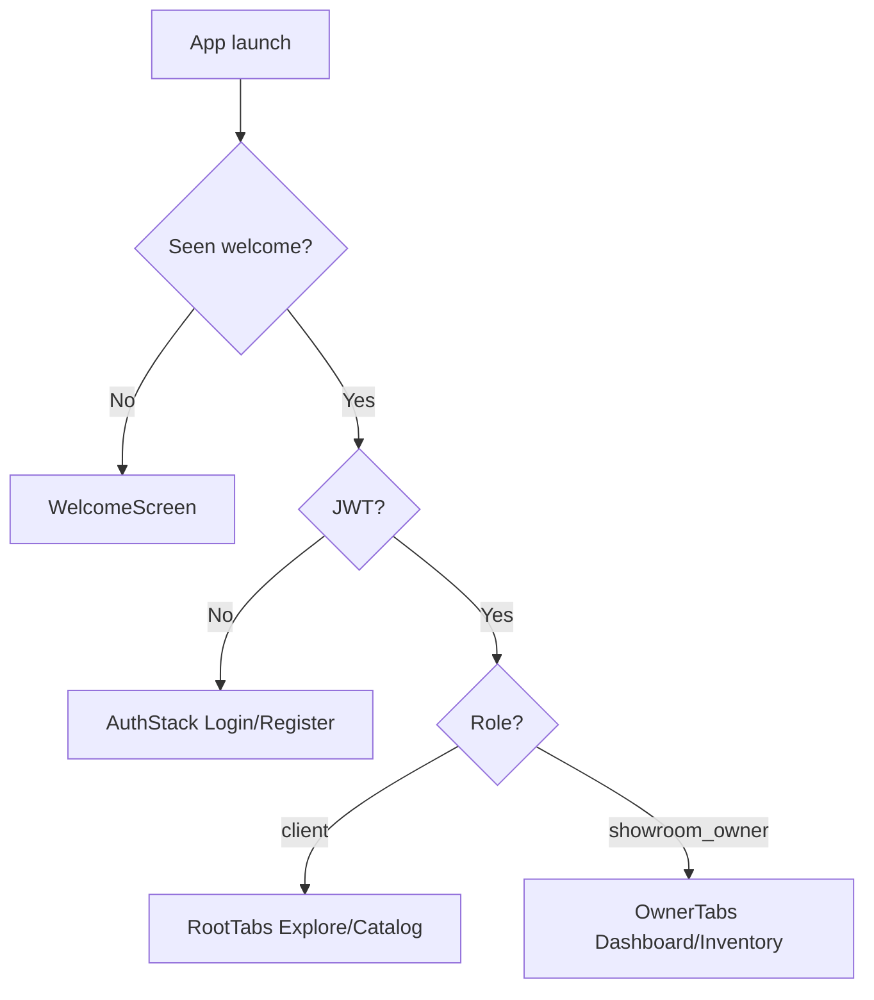

# RevvUp Frontend

React Native (Expo) mobile app for **RevvUp** — premium dark UI, NativeWind (Tailwind), and **role-based navigation** for clients vs showroom owners.

## Dual experience

| Role | Screens | Tabs |
| ---- | ------- | ---- |
| **Client** | Explore, Catalog, Details, Profile | `RootTabs` |
| **Showroom owner** | Dashboard, Inventory, Add bike, Profile | `OwnerTabs` |

Auth flow supports **role selection** at register (`client` | `showroom_owner`). JWT + role stored in AsyncStorage drive which tab navigator loads after login.

## Folder structure

```
revvup-frontend/
├── App.tsx
├── components/          # BikeCard, BikeSlider, Auth*, PrimaryButton
├── screens/
│   ├── auth/            # LoginScreen, RegisterScreen
│   ├── client/          # Welcome, Explore, Catalog, Details, Profile
│   └── owner/           # Dashboard, ManageInventory, AddEditBike
├── navigation/          # RootNavigator, AuthStack, RootTabs, OwnerTabs
├── theme/colors.ts      # Design tokens (#0A0A0B, #E63946, …)
├── lib/storage.ts       # Tokens, role, welcome flag
├── services/api.ts      # API client
└── config/api.ts
```

## NativeWind

- `global.css` + `tailwind.config.js` + `babel.config.js` (`nativewind/babel`)
- Use `className` on `View` / `Text` (dark backgrounds, red primary CTA)

## Navigation flow



## Environment

```env
EXPO_PUBLIC_API_URL=https://revvup-backend.vercel.app
```

## Run

```bash
npm install
npx expo start
# Device on another network:
npx expo start --tunnel
```

## API usage (by role)

| Screen | Endpoint |
| ------ | -------- |
| Explore / Catalog | `GET /api/v1/bikes` |
| Details | `GET /api/v1/bikes/{id}` |
| Owner inventory | `GET /api/v1/owner/bikes` + Bearer token |
| Add / edit bike | `POST` / `PUT /api/v1/owner/bikes` |

## Parent repo

Submodule of [revvup-app](https://github.com/ChamathDilshanC/revvup-app).
